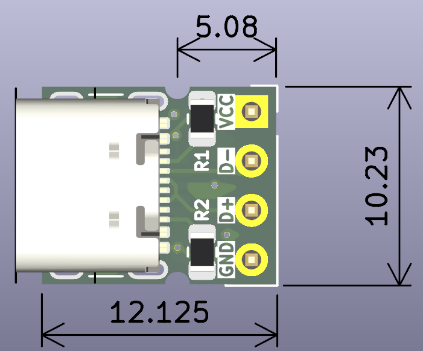
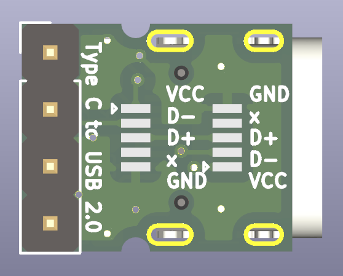
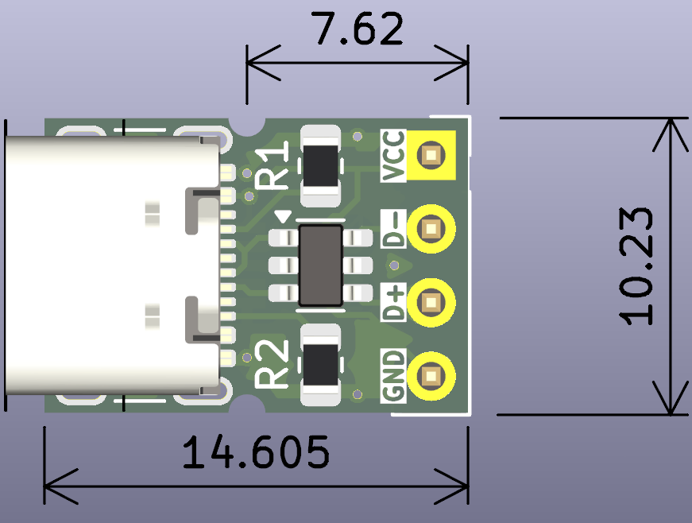
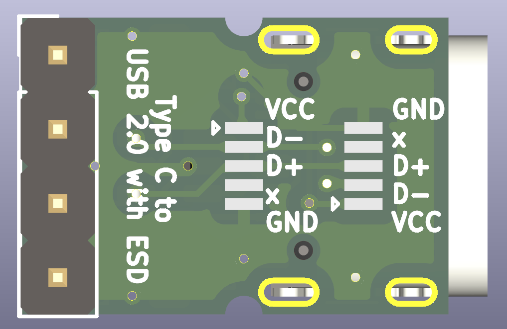
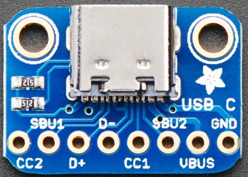
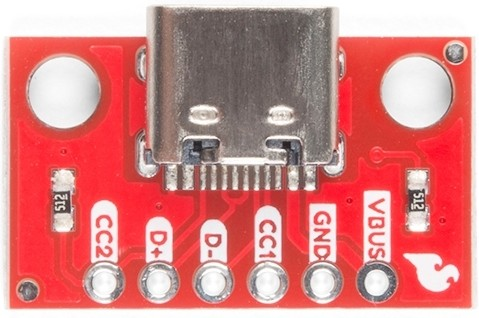
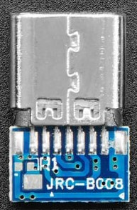
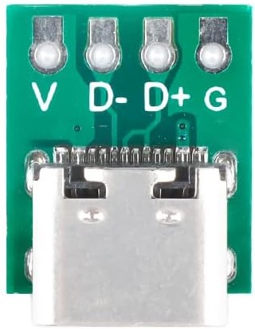

# [WIP] USB Type C Receptacle to USB 2.0 breakout board

A few breakout boards for USB Type C Receptacle to breadboard and flex ribbon cables.

## Purpose

Fix / upgrade some equipment that is still using previous generation of USB connectors

## Why?

1. Because most of found adapter boards are missing (or have only 1) pull-down 5K1 resistors, while 2 of those are required
2. I also want to have alternative option with EDS protection IC
3. I wanted to have extra opportunity to use 5-pin flat ribbon cable instead of loose wires

Additionally:

- use the size of SMD components that are still solderable manually (0805 Resistors)

## Details

This repository contains 2 kinds of breakout board:

- simple
- with ESD protection: utilizing USBLC6-2SC6 IC (same as used on STM32-Nucleo boards)

Both versions contain:
- 16-pin USB Type Receptacle
- 4-pin regular breadboard-friendly pin-header
- 2 x 5-pin soldering footprints for flat-ribbon cable with the same pitch as USB Micro connector
	- straight pin-out
	- mirrored pin-out

Solder to the footprint depending on the side, you'll install this adapter in your device. Silkscreen provides details regrading the pin-out.

## Visuals

| Variation | Top-view | Bottom view |
| :---         |     :---:      | :---: |
| Simple   |      |     |
| With ESD     |       |       |

## Remarks

There are a few tended vias used in these PCB, which is not ussually recomended. However, it seem to be the safest way of having some connections under the USB connector.  

## Thoughts on further

The only two things I would like to improove in these PCB are:

- to find pin-to-pin compatible USB Type C connector with water-proof housing
- havin extra the PCB mounting bracket (like the availble with M2 screws) 

## Inspirations

There are a few similar solutions on market. Not all of them has even footprints for pull-down resistors, and none of them have footprints for flex flat cable.

### Regular breakout boards

Available from manufacturers as [Adafruit](https://www.adafruit.com/product/4090), [Sparkfun](https://www.sparkfun.com/sparkfun-usb-c-breakout.html), [Popolu](https://www.pololu.com/product/2585), etc.

Usually have access to all additional pins (`CC1`, `CC2`, etc.) which make them large. However these variations are breadboard friendly.

|    |    |
| -- | -- |

### Simpistic breakout boards

Available from [Adafruit](https://www.adafruit.com/product/5180) and and some not so known brands. Usually very compact and might have the soldering place for breadboard pins.

|    |    |
| -- | -- |

### Other

[μC USB Type C Breakout Board](https://www.tindie.com/products/casualcoders/c-usb-type-c-breakout-board-5-pack/) by [Casual Coders](https://www.tindie.com/stores/casualcoders/) on Tindie.

Also, available on [GitHub](https://github.com/CasualCodersProjects/uC-Breakout)

It seem to be nice, but I don't need access to all 8 pins, it uses small size resistors and can't be used with breadboard. 

